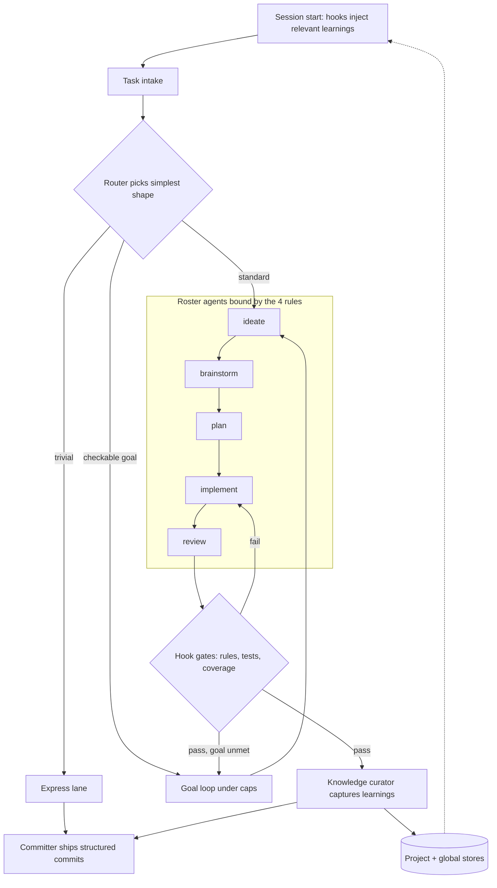
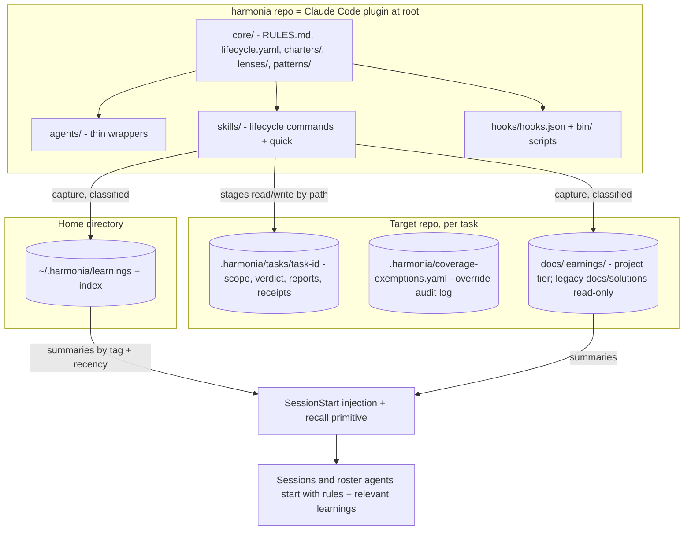

# Harmonia - Plan

## Goal Capsule

- **Objective:** Build version one of Harmonia, a self-contained, harness-portable SDLC plugin for Claude Code: portable core (4 rules, lifecycle, charters), thirteen-agent roster with a hierarchical review stage and a red-green implement loop, thin lifecycle commands, deterministic rule enforcement, soft coverage block, and two-tier learnings memory with session-start recall.
- **Product authority:** The Product Contract in this document; the user owns every product decision. Planning Contract and Implementation Units govern execution.
- **Execution profile:** Single greenfield repo, bash/YAML/markdown only, no external services; suitable for `ce-work` or an autonomous goal run.
- **Stop conditions:** Definition of Done met, or a blocker that changes product scope — surface it rather than guessing.
- **Open blockers:** None. Remaining unknowns are marked as implementation-time discovery.

---

## Product Contract

### Summary

Harmonia is a personal SDLC that runs on top of Claude Code: thin lifecycle commands orchestrate a thirteen-agent roster, hooks deterministically enforce everything a machine can check, review runs as a hierarchy under a review lead, implementation runs red-green against the coverage gate, and captured knowledge compounds across sessions and projects. The durable core — rules, lifecycle, agent charters, review lenses, knowledge — lives in plain files; harness wiring is a disposable adapter, with Claude Code first and OpenCode/pi possible later. Version one ships the lifecycle commands, the roster, rule enforcement, the soft coverage block, and two-tier learnings memory with session-start recall; the working-context store, the router, the goal loop, and hard gates layer on in later phases.

### Problem Frame

The user already develops with Claude Code plus several skill packs (compound-engineering, ralph-loop, and patterns drawn from three other repos), and manually combines their ideas into a working style. Four failures recur in that setup. Prior patterns and solved problems are not recalled in later sessions. Loops that should run unattended need babysitting. Work that should have iterated until a condition held ran once, sequentially, and stopped short. Subagent fan-out was the right execution shape and was never suggested.

The common cause: the capable pieces all exist, but every one of them fires only on model discretion or on the user remembering to invoke it. Nothing in the current setup decides — recall, loop-or-not, delegate-or-not are all optional behaviors. The cost is rework, re-derived knowledge, and supervision that the tooling was supposed to remove.

The five repos referenced throughout are inspiration only. This system systematizes the user's own workflow that already brings them together; it vendors nothing from them.

### Key Decisions

- **Named Harmonia.** From the Portuguese word for harmony and the Greek goddess Harmonia — the cosmos as ordered music and balance (Music of the Spheres). The name evokes order, structure, and beauty, which is what a good SDLC provides; it is instantly readable and pronounceable, and feels classical and mythic. The README carries this rationale as context.
- **Roster-first shape.** The specialized agents are the primary citizens; lifecycle commands are thin orchestrations naming which agents run in what order. The future router is "pick the roster subset" and the future goal loop is "re-run the roster until checks pass", so both arrive as extensions rather than rewrites.
- **Self-contained, inspiration only.** No runtime dependency on the five source repos and no vendored content. Chosen for control and durability over reuse of maintained upstream workflows.
- **Deterministic where checkable.** Every mechanically checkable policy is enforced by hooks; the model keeps judgment calls. This directly answers the "it never fired" failure mode; the accepted cost is some rigidity.
- **Portable core, disposable wiring.** The rules, lifecycle definitions, agent charters, and knowledge stores are the product and survive platform shifts. Harness adapters are replaceable wiring.
- **Three-store memory; adopt, don't build, for docs.** Learnings (two-tier), working context (survives sessions, loaded progressively), and external library docs via an adopted context7-class retrieval tool. The system owns the user's knowledge and builds no docs index of its own.
- **Checkable goals only.** Karpathy rule 4 acts as the intake gate: a goal must compile to machine-checkable conditions. Caps plus a written handoff replace babysitting.
- **Coverage as a ratchet.** 100% line-and-branch coverage on changed code, soft block from day one, hard gate later, exemptions always audited.
- **Opinionated, personal, public-ready.** Built for one user with engine/data separation from the first commit, so going public is packaging work. MIT license in the first commit. No general configuration surface.

### Actors

- A1. The developer — directs work, answers judgment questions, owns every opinion the system encodes.
- A2. The main session — the harness conversation that routes intake, runs lifecycle commands, and dispatches roster agents.
- A3. Roster agents — thirteen specialized subagents that collaborate within lifecycle runs; the review lead additionally dispatches transient lens subagents.
- A4. Harness enforcement — hooks that execute deterministic policy: recall injection, seam checks, loop continuation, gates.

### Requirements

**Portable core and rules**

- R1. The durable content — the 4 rules, lifecycle definitions, agent charters, review lenses, knowledge-store formats — lives in plain files readable without any harness.
- R2. Harness wiring is isolated in per-harness adapters; Claude Code is the first adapter, and adding another harness must not change core files.
- R3. The 4 Karpathy rules (Think Before Coding, Simplicity First, Surgical Changes, Goal-Driven Execution) are embedded in every agent charter and every lifecycle command as the working contract.

**Agent roster**

- R4. The roster ships thirteen agents: ideator, scoper, planner, implementer, test engineer, reviewer (review lead), simplifier, knowledge curator, committer, debugger, documentation producer, documentation reviewer, and rubber duck. Composition is expected to evolve with use.
- R5. Each agent definition declares its charter, how the 4 rules bind it, its collaboration contract (what it consumes from and produces for other agents), and a default model affinity that is overridable at invocation.
- R6. The committer organizes completed work into structured, logical commits with messages that communicate intent.
- R7. The debugger diagnoses problems in new or existing code; the rubber duck is a dialogic thinking partner the developer talks through problems with — the two roles stay distinct.
- R8. Agent outputs are consumable by the next stage's agents, so a lifecycle run passes work product along without the developer re-explaining context.

**Lifecycle commands**

- R9. Thin commands cover the cycle: ideate, brainstorm, plan, implement, review, capture knowledge. Each names which agents run and in what order, and holds no other logic.
- R10. An express lane exists for trivial tasks so a small fix does not convene the full roster.
- R11. The capture stage records learnings after every substantive unit of work, so later sessions start from accumulated knowledge rather than zero.

**Review hierarchy and test workflow**

- R28. Review runs as a hierarchy: the reviewer acts as review lead, chairing a panel drawn from the roster (test engineer, simplifier, documentation reviewer) and dispatching transient lenses — adversarial, security, performance — when the diff warrants; the security lens fires automatically on diffs touching auth, secrets, input parsing, or network-facing code. The lead dedupes, arbitrates, and writes one synthesized verdict to the task workspace.
- R29. A reusable panel primitive in core defines model-diverse fan-out with a synthesis step (N subagents, deliberately different model affinities, one arbitrated result); the review lead is its v1 consumer for lens dispatch, with wider roster uses named as future work.
- R30. Implement runs red-green: behavior-driven rounds start with the test engineer writing failing tests that the implementer then makes pass without editing tests; coverage-gap rounds are cover-first — the test engineer writes tests that execute the gate's named uncovered lines, and a test that arrives green completes the round with the implementer turn skipped. The gate's report feeds each next round until the diff bar is met; the override log is the audited exception, not the routine path.
- R31. The scoper owns scope definition: it produces the scope declaration — goal, in/out boundaries, non-goals, and machine-checkable success criteria — that the criteria gate validates before implement may start; the planner designs within that boundary rather than defining it.

**Enforcement and gates**

- R12. Every mechanically checkable policy is hook-enforced rather than model-discretionary: recall injection at session start, rule-compliance checks at stage seams, loop continuation, completion gates.
- R13. New and changed code must reach 100% line-and-branch coverage measured on the diff; exemptions require an inline justification the reviewer audits.
- R14. The coverage gate ships as a soft block: unmet coverage flags the work incomplete and proceeding requires a recorded override. A later phase hardens it to a hard block.
- R15. Non-coverable artifacts such as YAML configs get validation checks in place of coverage.
- R16. The system's own executable code (hook scripts, tooling) is held to the same testing bar.
- R17. Enforcement degrades gracefully per adapter: the core defines policies, each adapter enforces what its harness supports and reports what it cannot.

**Memory and context**

- R18. Learnings are two-tier: repo-specific solutions live in the repo; cross-project patterns and preferences live in a global personal store; session start injects relevant entries from both.
- R19. A working-context store survives sessions — task state, research dossiers, handoff reports — indexed so sessions load summaries first and detail on demand.
- R20. External library documentation comes from an adopted context7-class retrieval tool declared as a recommended dependency.
- R21. Client-work knowledge stays project-tier; the global store never receives client-specific content.
- R22. Personal data (knowledge stores, preferences) lives outside the repo or gitignored from the first commit; the repo contains only the engine.

**Router and goal loop**

- R23. A routing decision fires at task intake — express lane, lifecycle run, or goal loop, with or without subagent fan-out — biased to the simplest shape that fits and escalating only with a stateable reason.
- R24. The goal command accepts only machine-checkable stop conditions (commands exiting zero, composable); fuzzy goals are rejected at intake and sent back to be sharpened.
- R25. Goal loops run the full lifecycle per iteration under a max-iteration cap and optional time or budget caps; hitting a cap stops the loop and writes a handoff report to the working-context store so a later session resumes rather than restarts.

**Distribution and licensing**

- R26. The system is opinionated rather than configurable: the user's defaults ship as the behavior, with no general configuration surface.
- R27. The first commit carries an MIT license, and the five source repos are credited as inspiration.



### Key Flows

- F1. Standard lifecycle run
  - **Trigger:** The developer starts non-trivial work; the router selects a lifecycle run.
  - **Actors:** A1, A2, A3, A4
  - **Steps:** Session-start hook injects relevant learnings; lifecycle command dispatches roster agents stage by stage; hooks check rule compliance at each seam; review runs as a hierarchy under the review lead with tests, coverage, and warranted lenses; capture writes learnings; committer produces structured commits.
  - **Outcome:** Shipped work plus recorded knowledge. **Covers R8, R9, R11, R12, R28.**
- F2. Goal-loop run
  - **Trigger:** The developer states a goal with checkable conditions.
  - **Actors:** A2, A3, A4
  - **Steps:** Intake validates the conditions are machine-checkable; the loop runs full lifecycle iterations, re-routing agents each pass; a stop-hook continues the loop while conditions fail; on success it exits, on cap it writes a handoff report.
  - **Outcome:** Goal met, or a resumable handoff — never an unsupervised spin and never a silent early stop. **Covers R23, R24, R25.**
- F3. Compounding
  - **Trigger:** Any substantive unit of work completes.
  - **Actors:** A3 (knowledge curator), A4
  - **Steps:** The curator classifies each learning as project-tier or global-tier (client-specific content always project-tier); stores update; the next session's recall injection draws on the updated stores.
  - **Outcome:** Each iteration makes later ones faster; nothing relies on the developer remembering. **Covers R11, R18, R21.**

### Acceptance Examples

- AE1. **Covers R13, R14.** Given a diff with one uncovered branch, when review completes, then the work is flagged incomplete and proceeding requires a recorded override with a justification.
- AE2. **Covers R24.** Given the goal "make the CLI nicer", intake rejects it and asks for checkable conditions; given "tests green and diff coverage 100%", the loop starts.
- AE3. **Covers R25.** Given a goal loop at its iteration cap with conditions unmet, the loop stops and writes a handoff report; a later session resumes from the report instead of restarting.
- AE4. **Covers R18, R21.** Given a learning captured in a client repo that names client specifics, it lands in the project tier and the global store is unchanged.
- AE5. **Covers R12, R18.** Given a global learning about a recurring Go testing pitfall, when a session starts in any repo, the hook injects it without being asked.
- AE6. **Covers R17.** Given an adapter whose harness lacks stop-hooks, the goal loop declares advisory continuation for that harness instead of claiming enforcement it cannot deliver.
- AE7. **Covers R30, R13.** Given a gate report naming uncovered changed lines, the test engineer produces tests that execute those lines — failing tests where behavior is wrong, green-on-arrival tests where the code was correct but untested; the gate then passes with no override entry.
- AE8. **Covers R28.** Given a diff that introduces a new abstraction or touches auth-adjacent code, the review lead dispatches the adversarial (and, for the auth surface, security) lens, and the synthesized verdict contains their findings or explicit clean reports.

### Success Criteria

- A fresh session in a new repo applies at least one prior learning without being prompted.
- Every task intake produces a visible route decision, so "should have looped" and "should have fanned out" stop being post-hoc regrets.
- A goal run reaches its condition or hands off cleanly with zero mid-run human input.
- Adding a second harness adapter changes no file in the core.

### Scope Boundaries

**Deferred for later**

- OpenCode and pi adapters — the core/adapter layout guarantees they are additions, not rewrites.
- Post-v1 phases, in delivery order: working-context store and external-docs dependency, router, goal loop, coverage-gate hardening.
- Publish packaging: README/quickstart beyond install basics, marketplace listing polish, versioned releases.

**Outside this product's identity**

- A configurable community framework — this ships one user's opinions.
- Building documentation retrieval — adopted, not built.
- Runtime dependencies on the five inspiration repos.
- Multi-user or team features.

### Dependencies / Assumptions

- Claude Code's extension surface (skills, agent definitions, session-start and stop hooks) is the first adapter's substrate; it exists today and is treated as disposable wiring by design.
- A context7-class MCP documentation tool is installable; if absent, external-docs retrieval is skipped rather than replaced with a homegrown fallback.
- The target repo was verified empty on 2026-07-02; there is no migration burden.
- The currently installed plugins (compound-engineering, ralph-loop) keep serving daily work during buildout; retirement follows the coexistence checkpoints in the Planning Contract.
- The binding text of the 4 rules is as published by the andrej-karpathy-skills repo: Think Before Coding, Simplicity First, Surgical Changes, Goal-Driven Execution.

### Outstanding Questions

**Deferred to implementation**

- Exact relevance-scoring weights for recall (tag match vs recency) — tune against real learnings once a few dozen exist.
- kcov invocation details per platform; macOS behavior verified when first run there.
- Whether the marketplace accepts a root-path plugin source (`"./"`); U1 retires this first, and the Planning Contract records the fallback.
- Lens-trigger thresholds (what exactly counts as "the diff warrants" for adversarial and performance lenses) — tune with use; the security trigger list is fixed from day one.

### Sources / Research

- [multica-ai/andrej-karpathy-skills](https://github.com/multica-ai/andrej-karpathy-skills) — the 4 rules, verified verbatim from the repo and corroborating write-ups of the source post.
- [EveryInc/compound-engineering-plugin](https://github.com/EveryInc/compound-engineering-plugin) — lifecycle sequencing and the learnings-store pattern.
- [Yeachan-Heo/oh-my-claudecode](https://github.com/Yeachan-Heo/oh-my-claudecode) — hook-enforced persistence loops and tiered agent rosters.
- [addyosmani/agent-skills](https://github.com/addyosmani/agent-skills) — orchestration patterns and TDD/review doctrine.
- [mattpocock/skills](https://github.com/mattpocock/skills) — the minimalist counter-model: small composable skills and shared vocabulary.
- Claude Code plugin/hooks/agents/skills reference and marketplace docs (fetched 2026-07-02): manifest `.claude-plugin/plugin.json` with `name` required and `version` optional; components auto-discovered at plugin root (`skills/`, `agents/`, `hooks/hooks.json`, `.mcp.json`, `bin/`); SessionStart hooks inject stdout into context (matcher `compact` re-injects after compaction) and cannot block the session; hook `timeout` defaults to 600s; Stop hooks block with `{"decision":"block","reason":...}`, overridden after 8 consecutive blocks, `stop_hook_active` guards loops; agent `model:` accepts `haiku|sonnet|opus|inherit`; subagents can spawn nested subagents and the spawn tool exposes per-invocation model selection (corroborated against the live harness); `${CLAUDE_PLUGIN_ROOT}` is substituted in agent/skill bodies and exported to hook processes; installed plugins run from the plugin cache keyed by commit when `version` is omitted; register + install via `claude plugin marketplace add <owner>/<repo>` then `claude plugin install harmonia`; per-repo plugin disable via `enabledPlugins` in a repo's local settings.
- Installed-plugin inspection (2026-07-02): ralph-loop implements loop continuation as a Stop hook with a YAML-frontmatter state file (iteration, session id, completion promise), fails open on corruption, defaults to unlimited iterations — the pattern to adopt later with a finite default cap. compound-engineering deleted its standalone agents directory in favor of skill-embedded prompt files for portability — the concern our core/adapter split answers with first-class agents kept thin. CE's `docs/solutions/` carries an app-specific schema and `ce-compound-refresh` actively rewrites or deletes entries that look schema-drifted — the reason Harmonia's project tier lives in its own directory.

---

## Planning Contract

Product Contract preservation: changed — Summary and Scope Boundaries updated to pull two-tier memory and session-start recall into v1; product renamed Harmonia with the naming rationale recorded; roster grown to thirteen (scoper added); review hierarchy, lenses, panel primitive, and red-green workflow added as R28-R31 with AE7-AE8; R29 narrowed to the review lead as v1 consumer and R30/AE7 amended to cover-first semantics for coverage-gap rounds (review-round decisions with user sign-off). All changes user-directed during planning; prior R/A/F/AE IDs otherwise unchanged.

### Key Technical Decisions

- **KTD1. Root-is-plugin repo layout.** The repo root is the Claude Code plugin (`.claude-plugin/plugin.json`, `skills/`, `agents/`, `hooks/`, `bin/`) with `core/` as a sibling directory inside the same root; future adapters read `core/` in place. Rejected alternative: an `adapters/claude-code/` split, which reads cleaner but forces a copy/sync step because plugin installation copies only the plugin directory. Single-plugin `marketplace.json` lives beside the manifest so `claude plugin marketplace add foliveira/harmonia` followed by `claude plugin install harmonia` works across machines. The root-path source assumption is retired first in U1, before any other file lands, because the fallback (a plugin subdirectory) relocates every path in Output Structure.
- **KTD2. Charter-reference binding.** Adapter agent files are thin: Claude Code frontmatter (`name`, `description`, `model`) plus a body that instructs the agent to read `core/RULES.md` and its charter under `core/charters/` via `${CLAUDE_PLUGIN_ROOT}`. The variable is substituted in agent/skill bodies, so paths must appear literally in the body — never reconstructed in shell, where the variable may be unset. Every agent body also carries the literal path to `bin/memory/recall.sh` so roster agents can invoke recall directly (KTD5). Every agent body carries a refusal clause: if the rules or charter cannot be read, stop and report the path rather than proceeding uncharted. One source of truth, no duplication, no build step; the cost is two file reads per agent spawn.
- **KTD3. Machine-readable lifecycle.** `core/lifecycle.yaml` defines stages, per-stage agent sequences, artifacts, and gates, validated against `core/lifecycle.schema.json`. Stage entries name their artifact locations in the task workspace (KTD10) so the schema validates the contract, and lifecycle skills stay thin by reading it instead of hardcoding stage logic (R9). The schema also carries the review stage's panel membership and lens name list, the quick stage's lead-solo review declaration (KTD11), and the implement stage's red-green loop definition including its max-rounds cap (KTD12). Schema conformance is checked with check-jsonschema (yamllint covers syntax only); `bin/validate-core.sh` exits with a distinct cannot-validate code when the tool is missing.
- **KTD4. No plugin version field.** Omitting `version` from `plugin.json` makes every commit an auto-update on all machines — the documented pattern for personal/internal plugins. Consequence: the installed copy runs from the plugin cache at the last-updated commit, so uncommitted edits in the working checkout never reach live behavior. The canonical dogfood loop is commit → `/plugin update` → fresh session (U8). Switch to semver only when deliberate releases matter.
- **KTD5. Memory as plain markdown, two tiers, own directory.** Global tier: `~/.harmonia/learnings/` (hidden folder in the home directory — user decision) with an `~/.harmonia/index.md` of one-line summaries plus tags. Project tier: `docs/learnings/` in the target repo, using Harmonia's own schema (title, date, language/topic tags, tier, source repo) — deliberately not CE's `docs/solutions/`, so CE tooling never touches Harmonia entries and no cross-tool schema compatibility is owed. For continuity, `recall.sh` additionally reads existing `docs/solutions/` entries read-only, so accumulated CE learnings keep surfacing. Capture classifies each learning (client-specific → project tier only, R21); recall injects index summaries filtered by language/topic tags and recency, never full bodies. Recall is a primitive any roster agent may invoke directly, and skills forward relevant summaries in dispatch prompts — without this, recall benefits stop at the main session (R18 for A3, not just A2).
- **KTD6. Coverage engine = diff driver + per-language adapters, adopt-first.** U7 opens with an adopt-vs-build spike: run diff-cover against the three planned fixtures (vitest/v8 LCOV, converted Go coverprofile, kcov Cobertura); the spike bar is line-and-branch on the diff for the TS fixture and line-on-diff for the Go and bash fixtures — Go coverprofile records statement coverage and kcov records line coverage, so branch enforcement applies only where the format carries branch records, with branches marked unmeasured in the report (advisory cannot-measure shape) elsewhere. On a passing spike, `gate.sh` wraps diff-cover and the adapters shrink to emitting standard formats; the bespoke driver is built only if the spike fails, and the verdict is recorded here. Either way `gate.sh --base <ref>` computes changed lines, writes its report — uncovered changed lines per file plus an exemptions-honored section (file, line, marker justification) — and a run receipt to the task workspace, and enforces: changed lines in files absent from the coverage data count as uncovered (a new untested file can never false-pass); diffs in languages without an adapter, or runs missing a required tool (kcov, diff-cover), exit with a distinct cannot-measure code that review surfaces as an advisory note, no override required. Exemptions are anchored in code: a recognized per-language comment marker with an inline justification is what the gate honors (markers move with the code and expire when it is rewritten — R13's "inline justification" made literal); `.harmonia/coverage-exemptions.yaml` is an append-only audit log of overrides, versioned so it travels with the repo. YAML files route to validation (yamllint + schema) instead of coverage (R15). The gate report doubles as the input for the implement loop's gap rounds (KTD12).
- **KTD7. Minimal v1 hook set, honest enforcement tiers.** Enforcement comes in three tiers: (A) harness-enforced — a hook executes and the model cannot skip it; (B) deterministic-verdict, instruction-invoked — a gate script whose verdict is mechanical but whose invocation is model-followed, made auditable by a run receipt written to the task workspace and verified by the review stage, which fails work with missing or stale receipts; (C) model judgment bound by charters. A receipt carries the task-id, a timestamp, and a digest of the evaluated diff; review recomputes the digest and treats any mismatch as stale. V1 delivers tier A for context injection (one SessionStart command hook, also matched on `compact`, running `bin/inject-context.sh`: rules digest + recall summaries under one hard size cap, since the payload re-enters context after every compaction), and tier B for the criteria and coverage gates (`bin/check-criteria.sh` before implement; the coverage gate at review — each writes a receipt) and for test-immutability in the implement loop (KTD12). Invocation hardening to tier A (PreToolUse/Stop wrappers) joins P5. The `hooks.json` entry sets an explicit small timeout in seconds — the default is 600s, and a hung recall would stall every session on the machine. The Stop-hook goal loop is deferred; when built, it adopts ralph-loop's state-file pattern with a finite default cap.
- **KTD8. Express lane is a command.** `/harmonia:quick` runs implementer + reviewer only, with rules injection and the coverage soft block still active (R10). Quick's review is lead-solo per its stage declaration (KTD11) — no panel, though the security lens auto-trigger still applies. It mints a task workspace like any entry stage (KTD10) since the gate and audit log need paths. Full routing intelligence waits for the router phase.
- **KTD9. Engine tooling is bash + YAML only.** No TypeScript or Go in the engine; target-language expertise lives in charters, not engine code. Tests via bats-core; script coverage via kcov, gated by the engine's own diff driver (R16).
- **KTD10. Inter-stage artifact contract: a per-task workspace.** Each task gets `.harmonia/tasks/<task-id>/` in the target repo — the shared workspace stages read and write by path, never by re-explanation (R8). Workspace mechanics are owned by `bin/workspace.sh` (subcommands: mint, resolve, complete, abandon), which skills invoke via the literal `${CLAUDE_PLUGIN_ROOT}` path. Every stage skill accepts an optional task-id argument. When absent: entry stages (ideate, brainstorm, plan, quick) mint a new task-id (date + slug) — but refuse to mint when an incomplete workspace already exists, stopping and naming its task-id so the user either passes it to continue or forces a fresh mint with an explicit new-task flag; later stages (implement, review, capture) resolve to the single workspace not yet marked complete or abandoned, erroring on ambiguity with an enumeration of candidate task-ids and mint dates, and exiting with a clean no-active-task error when none exists. Capture (and quick, at its close) writes a completion marker; the abandon subcommand retires a workspace that will never reach capture through the same marker mechanism; both make workspaces prunable and recovery is always re-invocation with an explicit task-id, never manual deletion. Every receipt echoes the resolved task-id so a wrong pick is visible. Minting records the diff base ref at workspace creation and writes `.harmonia/tasks/.gitignore` containing `*`, so the directory is self-ignoring in every target repo without touching the host repo's own ignore rules. Ownership: the scoper produces the scope declaration — including the machine-checkable criteria `check-criteria.sh` validates and implement consumes (R31); the planner produces the design within it; implement produces the task boundary and diff summary on completion; review produces the synthesized verdict, the gate report, and its exemption-audit result; capture consumes verdict + criteria + diff summary, writes to the KTD5 memory tiers, and hands the artifact trail to the committer. Plan documents themselves stay in `docs/plans/` (versioned); task workspaces are ephemeral and gitignored; the exemptions audit log is versioned (KTD6). Interruption recovery in v1 is re-invoking a stage skill against the durable artifacts on disk: lifecycle runs are single-session, the task workspace is the checkpoint, and run-level state arrives with P2.
- **KTD11. Hierarchical review: lead, panel, lenses.** The reviewer charter carries lead authority — dedupe, arbitration, one synthesized verdict to the task workspace — while panel convening authority lives in the stage definition: `lifecycle.yaml`'s review stage declares the panel roster (test engineer, simplifier, documentation reviewer) and the lens name list, quick declares lead-solo review, and the reviewer charter defers panel convening to the invoking stage. Lens frontmatter is the single authority for trigger rules (security auto-fires on auth/secrets/input-parsing/network-facing diffs; adversarial and performance fire when the diff warrants — new abstractions, architectural changes, hot paths); the schema validates that each lens named in the stage resolves to a `core/lenses/` file. Lenses are prompt assets seeded into transient subagents — capabilities, not roster members, so the roster stays thirteen. The panel primitive in `core/patterns/panel.md` defines model-diverse fan-out plus synthesis (R29), consumed in v1 by the review lead. Nested spawning and per-invocation model selection are corroborated against the live harness; U3's verification still runs a nested-dispatch probe, and if named nested dispatch or invocation-time override fails in practice, lenses ship as thin defined agents with model frontmatter and the fallback is recorded here.
- **KTD12. Red-green implement loop.** The implement stage alternates test engineer and implementer, reading the loop definition — including its max-rounds cap — from `lifecycle.yaml`. Behavior-driven rounds are red-first: the test engineer writes failing tests, the implementer makes them pass and may not edit tests. Coverage-gap rounds are cover-first: the test engineer writes tests that execute the gate's named uncovered lines, verifying they exercise those lines; a test that arrives green completes the round with the implementer turn skipped (correct-but-untested code cannot yield a red test without breaking the code). Test-immutability is tier-B enforced (KTD7): the implement skill records test-file hashes after each test-engineer turn and verifies them before accepting a green round; a mismatch fails the round and writes a violation record to the task workspace, which review treats like a missing receipt. On reaching the max-rounds cap the loop exits incomplete and records the test/implementation disagreement in the task workspace for the review lead to arbitrate — never escaping via an exemption marker. Loop exit: bar met, justified in-code exemption marker, or cap-with-arbitration (R30, AE7).

### Assumptions

- A root-path plugin source (`"./"`) in `marketplace.json` is accepted; if not, the fallback is a one-level plugin subdirectory with the marketplace pointing at it (KTD1 survives either way). U1 retires this assumption before other files land.
- kcov is installable on the user's platforms (verified concept on Linux; macOS checked at first use).
- Dev toolchain for the engine repo: bats-core, jq, yamllint, check-jsonschema, plus diff-cover (pip/pipx) and gocover-cobertura on any machine where the coverage spike or gate runs; `bin/validate-core.sh` and the gate exit with distinct cannot-validate / cannot-measure codes when a tool is missing rather than false-passing.
- Target repos bring their own toolchains (vitest, go); the engine detects and reports rather than installs.
- Coexistence with compound-engineering is actively managed, not assumed away: Harmonia skill descriptions are scoped to explicit `/harmonia:` invocation while CE remains installed, so broad phrasing ("plan this") keeps routing to CE deterministically; project-tier stores are disjoint (`docs/learnings/` for Harmonia, `docs/solutions/` for CE) so CE tooling never touches Harmonia entries, with recall reading legacy CE entries read-only; `docs/plans/` filename conventions are shared, and the daily NNN sequence prevents collisions. Retirement checkpoints: capture lands (U5) → stop using ce-compound for new learnings; review lands → stop ce-code-review; the full cycle proves out in U8 → new work starts in `/harmonia:` commands.

### System-Wide Impact

- **Machine-wide hook reach.** Once enabled, the SessionStart hook runs in every repo on the machine. Injection stays default-on (the product intent — AE5 says "any repo"); the levers are per-repo disable via `enabledPlugins` in a repo's local settings (native, zero code, documented in the README for client repos), an environment kill-switch (e.g., `HARMONIA_DISABLE=1`) checked first in `inject-context.sh` (the brake that works even when the hook misbehaves), and install scope. Residual accepted: global learnings are injected into client-repo sessions by design; only capture direction is restricted (R21).
- **Failure containment.** SessionStart cannot block a session, but garbage stdout becomes injected context: on any internal error the script emits nothing to stdout (errors to stderr) and exits zero. The hook timeout is set explicitly in seconds.
- **Concurrency.** Multiple sessions capture concurrently: index updates are atomic (write-then-rename or lock), and recall tolerates duplicate or torn index lines rather than crashing session start.
- **Stale cache as a standing confusion source.** Live behavior comes from the plugin cache, not the working checkout (KTD4); green tests on the working tree prove nothing about live hooks until commit + `/plugin update`.

### High-Level Technical Design



### Output Structure

Scope declaration for the expected v1 layout; per-unit `**Files:**` lists stay authoritative.

```text
harmonia/
├── .claude-plugin/
│   ├── plugin.json           # name: harmonia; no version (KTD4)
│   └── marketplace.json      # single-plugin marketplace (KTD1)
├── core/                     # portable, harness-independent (R1)
│   ├── RULES.md              # the 4 rules, canonical text
│   ├── lifecycle.yaml        # stages, agent sequences, artifact contract, gates
│   ├── lifecycle.schema.json
│   ├── charters/             # 13 agent charters
│   ├── lenses/               # adversarial.md, security.md, performance.md (KTD11)
│   └── patterns/             # panel.md - model-diverse fan-out + synthesis (R29)
├── agents/                   # Claude Code adapter agents (KTD2)
├── skills/                   # ideate, brainstorm, plan, implement, review, capture, quick
├── hooks/
│   └── hooks.json            # SessionStart → bin/inject-context.sh (explicit timeout)
├── bin/
│   ├── inject-context.sh
│   ├── check-criteria.sh
│   ├── workspace.sh          # mint, resolve, complete, abandon (KTD10)
│   ├── memory/               # capture.sh, recall.sh, store-lib.sh
│   └── coverage/             # gate.sh, ts.sh, go.sh, bash.sh
├── tests/                    # bats suites + fixtures
├── docs/plans/               # this artifact
├── LICENSE                   # MIT (R27)
└── README.md                 # install, usage, and the Harmonia naming rationale
```

---

## Implementation Units

### U1. Repo and plugin scaffold

- **Goal:** An installable, empty-but-valid plugin: manifest, single-plugin marketplace, MIT license, engine/data hygiene.
- **Requirements:** R2, R22, R26, R27
- **Dependencies:** None
- **Files:** `.claude-plugin/plugin.json`, `.claude-plugin/marketplace.json`, `LICENSE`, `.gitignore`, `README.md` (install stub), `tests/scaffold.bats`
- **Approach:** First action: verify the root-path marketplace source against a local install, before any other file lands; on rejection, apply the KTD1 fallback and record it. Manifest per KTD1/KTD4 (name `harmonia`, no version). `.gitignore` excludes `.harmonia/tasks/` (ephemeral task workspaces) and personal/local state — but not `.harmonia/coverage-exemptions.yaml`, which is versioned (KTD6, R22). README covers install (`claude plugin marketplace add` then `claude plugin install harmonia`), the per-repo disable for client repos (`enabledPlugins`), the roster at one-line depth, the inspiration credits (R27), and the naming rationale: Harmonia — Portuguese for harmony and the Greek goddess of harmony, the cosmos as ordered music and balance (Music of the Spheres); order, structure, and beauty as what a good SDLC provides.
- **Test scenarios:**
  - `plugin.json` parses and contains required `name` in kebab-case; no `version` key present.
  - `marketplace.json` parses and references the plugin source; schema-required fields present.
  - `LICENSE` is MIT with the current year and the user as holder.
  - `git check-ignore` confirms a fixture `.harmonia/tasks/x/file` is ignored while `.harmonia/coverage-exemptions.yaml` is not.
  - README contains the naming-rationale section (grep-level guard).
- **Verification:** `bats tests/scaffold.bats` green; `claude plugin marketplace add` against the local checkout succeeds, `claude plugin install harmonia` succeeds, and the plugin lists as enabled.

### U2. Portable core: rules and lifecycle

- **Goal:** The harness-independent core: canonical rules text and a machine-readable lifecycle definition carrying the artifact contract, panel/lens fields, and the red-green loop definition.
- **Requirements:** R1, R3, R9, R15
- **Dependencies:** U1
- **Files:** `core/RULES.md`, `core/lifecycle.yaml`, `core/lifecycle.schema.json`, `bin/validate-core.sh`, `tests/core.bats`
- **Approach:** `RULES.md` carries the four rules verbatim with a short binding clause per rule (what obeying it means inside this system). `lifecycle.yaml` defines the six stages plus `quick`: per stage — purpose, agent sequence, artifacts in/out named as task-workspace locations (KTD10), gates (KTD3); the review stage carries panel membership and the lens name list (trigger rules live in lens frontmatter — KTD11), quick declares lead-solo review, the implement stage carries the red-green loop definition including its max-rounds cap (KTD12), and the capture stage sequence ends with the committer (curator → committer). Validation runs yamllint for syntax plus check-jsonschema for schema conformance (KTD3); `bin/validate-core.sh` exits with a distinct cannot-validate code when check-jsonschema is missing.
- **Test scenarios:**
  - Valid `lifecycle.yaml` passes `bin/validate-core.sh`; removing a required stage field fails it with a named error.
  - Schema rejects an unknown agent reference in a stage sequence, a stage artifact entry without a workspace location, a review stage naming a lens with no matching `core/lenses/` file, and an implement stage missing its max-rounds cap (fixtures).
  - With check-jsonschema absent (fixture PATH), `bin/validate-core.sh` exits with the distinct cannot-validate code, never a false pass.
  - `RULES.md` contains all four rule names exactly once each (guard against drift).
- **Verification:** `bats tests/core.bats` green; `bin/validate-core.sh` exits zero on the shipped core.

### U3. Agent roster, lenses, and panel primitive

- **Goal:** Thirteen charters in core, thirteen thin Claude Code agents binding to them, the review lenses, and the panel pattern.
- **Requirements:** R3, R4, R5, R6, R7, R28, R29, R31
- **Dependencies:** U2
- **Files:** `core/charters/*.md` (ideator, scoper, planner, implementer, test-engineer, reviewer, simplifier, knowledge-curator, committer, debugger, doc-producer, doc-reviewer, rubber-duck), `core/lenses/adversarial.md`, `core/lenses/security.md`, `core/lenses/performance.md`, `core/patterns/panel.md`, `agents/*.md` (same thirteen), `tests/roster.bats`
- **Approach:** Charter frontmatter: role, model affinity, consumes, produces, rules binding; body: scope of authority, collaboration contract, refusals. Consumes/produces name task-workspace artifacts (KTD10): the scoper produces the scope declaration with checkable criteria (R31); the reviewer charter carries review-lead authority — arbitration and the single verdict, with panel convening deferred to the invoking stage (KTD11) — and consumes the scope declaration, diff base ref, gate report including its exemptions-honored section (a mandatory audit input), gate receipts (failing work whose receipts are missing or stale, KTD7), and audit-log delta; the test engineer's charter carries the red-first and cover-first round disciplines (R30); the committer consumes the task's artifact trail and task boundary to write commits that communicate intent (R6); the knowledge curator consumes verdict + criteria + diff summary rather than session hearsay. Lenses are prompt assets whose frontmatter is the single trigger authority (KTD11), not roster members. `core/patterns/panel.md` specifies model-diverse fan-out and the synthesis step (R29). Adapter agents per KTD2: frontmatter maps model affinity to `model:` (committer → `haiku`; judgment-heavy roles → `inherit`), body carries the literal `${CLAUDE_PLUGIN_ROOT}` paths to the rules, the charter, and `bin/memory/recall.sh`, plus the refusal clause for unreadable rules/charter.
- **Test scenarios:**
  - Exactly thirteen charters and thirteen agents; names match 1:1 (fixture-driven parity check).
  - Every charter frontmatter has role, model affinity, consumes, produces; every agent frontmatter has name, description, legal `model` value (`haiku|sonnet|opus|inherit`).
  - Every agent body contains literal `${CLAUDE_PLUGIN_ROOT}` references to `core/RULES.md`, its charter, and `bin/memory/recall.sh`, plus the refusal clause (grep-level guards).
  - Every charter `consumes` entry resolves to some prior stage's `produces` or a contract location in `lifecycle.yaml` (closes R5 against KTD3/KTD10).
  - The three lens files exist with trigger frontmatter; the security lens's trigger list includes auth, secrets, input parsing, and network-facing surfaces (grep-level guard).
  - `core/patterns/panel.md` exists and names the synthesis step.
- **Verification:** `bats tests/roster.bats` green; spawning one agent manually shows it resolves and quotes its charter content before acting; a nested-dispatch probe has the review lead spawn one named panel member and one lens, recording which model served each — if named nested dispatch or invocation-time model override fails, lenses ship as thin defined agents with model frontmatter and the fallback is recorded in KTD11.

### U4. Memory stores and recall library

- **Goal:** Two-tier learnings storage with capture and recall scripts, global tier under `~/.harmonia/`, project tier in `docs/learnings/`.
- **Requirements:** R18, R21, R22
- **Dependencies:** U1
- **Files:** `bin/memory/store-lib.sh`, `bin/memory/capture.sh`, `bin/memory/recall.sh`, `tests/memory.bats`
- **Execution note:** Test-first; these scripts gate everything the memory promise rests on.
- **Approach:** Learning format is Harmonia's own schema: markdown with frontmatter (title, date, language/topic tags, tier, source repo). Global tier `~/.harmonia/learnings/` plus maintained `~/.harmonia/index.md`; project tier `docs/learnings/` in the target repo (KTD5 — deliberately disjoint from CE's `docs/solutions/`). `recall.sh` additionally reads existing `docs/solutions/` entries read-only for legacy continuity. `capture.sh` takes a drafted learning, a tier decision, and a client flag: client-flagged content is refused for global tier (R21). Index writes are atomic (write-then-rename or lock). `recall.sh` emits summaries filtered by tag overlap and recency under a hard output budget; repo identity keys on the git common dir or remote URL, not cwd path, so worktrees of one project read as one repo. Any roster agent may invoke `recall.sh` directly (KTD5 parity).
- **Test scenarios:**
  - Capturing a global learning creates the file and appends exactly one index line (idempotent on re-run).
  - Capturing with the client flag and tier=global exits non-zero with a refusal message; tier=project succeeds and lands in `docs/learnings/`.
  - Recall in a fixture Go repo returns the Go-tagged learning summary and omits an unrelated TypeScript one (AE5 shape at script level).
  - Recall respects the injection budget: with many matching learnings, output stays within the cap and prefers recent entries.
  - `recall.sh` surfaces a genuine compound-engineering-written `docs/solutions/` entry from a fixture read-only, and never writes to that directory (legacy continuity).
  - Two concurrent captures leave a valid index with both entries (atomicity); recall on a fixture index with a duplicated/torn line warns and continues.
  - A worktree fixture of the same project yields the same repo identity as the main checkout.
  - Store operations on a corrupted index fail open: recall returns empty with a warning, never crashes the session.
- **Verification:** `bats tests/memory.bats` green; manual: capture one real learning, confirm file + index entry.

### U5. Lifecycle skills

- **Goal:** Seven thin commands — the six stages plus quick — orchestrating the roster per the core lifecycle over the task workspace, including the hierarchical review, red-green implement, and committer-closed capture behaviors.
- **Requirements:** R3, R8, R9, R10, R11, R28, R30, R31
- **Dependencies:** U2, U3, U4, U6, U7
- **Files:** `skills/ideate/SKILL.md`, `skills/brainstorm/SKILL.md`, `skills/plan/SKILL.md`, `skills/implement/SKILL.md`, `skills/review/SKILL.md`, `skills/capture/SKILL.md`, `skills/quick/SKILL.md`, `bin/workspace.sh`, `tests/skills.bats`
- **Approach:** Each SKILL.md references `core/RULES.md` via the literal `${CLAUDE_PLUGIN_ROOT}` path as its working contract (R3), reads its stage from `core/lifecycle.yaml`, and dispatches the named agents in order, passing artifact paths in the task workspace — not prose summaries (R8, KTD10). Workspace mechanics live in `bin/workspace.sh` (mint, resolve, complete, abandon — writes the base ref, the self-ignoring `.gitignore`, and the markers; prints the resolved task-id), invoked by skills via the literal path and covered by the self gate (R16). Stage skills accept an optional task-id; entry stages mint but refuse to mint over an existing incomplete workspace (naming it; continue by passing the id or force with the new-task flag); later stages resolve per KTD10, erroring on ambiguity with candidate enumeration and exiting cleanly when no active task exists. Whichever scope-bearing stage runs first for a task — brainstorm when invoked, otherwise plan — dispatches the scoper to mint the scope declaration once; a stage finding an existing declaration consumes and refines it rather than re-minting (R31). Implement requires the declaration's criteria at their contract path, runs `bin/check-criteria.sh` before starting, drives the red-green/cover-first alternation per KTD12 — recording test-file hashes after each test-engineer turn and failing a green round whose hashes moved — and produces the task boundary and diff summary on completion. Review runs the KTD11 hierarchy per its stage declaration: panel plus triggered lenses (lead-solo for quick), gate and audit-log check against the recorded base ref, exemptions-honored audit, receipt verification (missing or stale receipts fail the review, KTD7), one synthesized verdict to the workspace. Capture drives the knowledge curator through `bin/memory/capture.sh` with the tier decision and client flag (R11), then the committer over the artifact trail (R6), and writes the completion marker. During coexistence with compound-engineering, skill descriptions scope to explicit `/harmonia:` invocation so broad phrasing keeps routing to CE deterministically. Skills carry no stage logic beyond orchestration (R9).
- **Test scenarios:**
  - Each SKILL.md has valid frontmatter (name, description); the seven skill names match the stages in `lifecycle.yaml` (parity fixture).
  - A lint check confirms every skill body references `core/RULES.md`, `core/lifecycle.yaml`, and task-workspace paths rather than hardcoding agent lists or passing prose (grep-level guard).
  - `bin/workspace.sh` matrix: an entry-stage mint creates the workspace with base ref and self-ignoring `.gitignore` (`git check-ignore` passes in a repo with no prior ignore rules); mint over an existing incomplete workspace refuses and names it, while the new-task flag forces a fresh mint; a later stage resolves to the single incomplete workspace; with two incomplete workspaces it exits with the ambiguity error enumerating task-ids and mint dates; with none it exits with the no-active-task error; after a completion or abandon marker, resolution skips that workspace.
  - Test-immutability shape: with a fixture workspace where test-file hashes moved between the test-engineer turn and the green claim, the implement skill's hash check fails the round and writes the violation record.
  - Test expectation for conversational behavior: none — skill prose is exercised by the U8 walkthrough, not unit tests.
- **Verification:** `bats tests/skills.bats` green; `/harmonia:quick` on a sandbox change mints a task workspace, runs implementer then reviewer (lead-solo), and applies the gates.

### U6. Enforcement hooks and gate scripts

- **Goal:** Deterministic v1 enforcement: session-start injection of rules + recall (tier A), and the criteria gate with receipts (tier B).
- **Requirements:** R12, R3, R18
- **Dependencies:** U2, U4
- **Files:** `hooks/hooks.json`, `bin/inject-context.sh`, `bin/check-criteria.sh`, `tests/hooks.bats`
- **Execution note:** Test-first; a broken SessionStart hook degrades every session on the machine.
- **Approach:** `hooks.json` wires SessionStart (including the `compact` matcher) to `bin/inject-context.sh` with an explicit small `timeout` in seconds (KTD7). The script emits a rules digest plus recall summaries under one hard size cap; the environment kill-switch is checked first; on any internal error it emits nothing to stdout (errors to stderr) and exits zero. `check-criteria.sh` validates the criteria in the scope declaration at its KTD10 contract path — each criterion a runnable command line — and writes a run receipt (task-id, timestamp, diff digest per KTD7) to the task workspace; non-zero exit carries a per-criterion report. Scripts resolve plugin files via `${CLAUDE_PLUGIN_ROOT}` (exported to hook processes).
- **Test scenarios:**
  - `inject-context.sh` output contains all four rule names and, given a fixture store, the matching learning summary (Covers AE5.)
  - Output stays under the hard size cap with an oversized fixture store; the kill-switch env var yields empty output and exit zero.
  - With an empty or missing global store, injection emits rules only and exits zero; with an internal error (unreadable index fixture), stdout is empty and stderr carries the warning.
  - A spawned agent running `recall.sh` directly receives the same summaries the injection emitted (parity for roster agents, AE5 beyond the main session).
  - `check-criteria.sh` accepts a fixture with two runnable criteria and writes a receipt carrying task-id, timestamp, and diff digest; rejects prose-only criteria ("make it nicer") with a non-zero exit naming the offender and still writes the receipt (Covers the intake shape of AE2.)
  - `hooks.json` parses, sets an explicit timeout, and references only scripts that exist and are executable.
- **Verification:** `bats tests/hooks.bats` green; opening a fresh session in a fixture repo visibly injects rules + one learning.

### U7. Coverage engine

- **Goal:** Diff-based coverage measurement with per-language adapters and the audited soft block, reporting into the task workspace and feeding the red-green loop.
- **Requirements:** R13, R14, R15, R16, R30
- **Dependencies:** U1
- **Files:** `bin/coverage/gate.sh`, `bin/coverage/ts.sh`, `bin/coverage/go.sh`, `bin/coverage/bash.sh`, `tests/coverage.bats`, `tests/fixtures/coverage/`
- **Execution note:** Test-first with fixture coverage data; this is the highest-complexity engine code if the spike fails.
- **Approach:** Per KTD6. First action — the adopt-vs-build spike: run diff-cover against the three planned fixtures with the per-language bar (line-and-branch for the TS/LCOV fixture; line-only for Go coverprofile and kcov, whose formats carry no branch records); on pass, `gate.sh` wraps diff-cover and the adapters shrink to emitting LCOV/Cobertura; on fail, build the bespoke driver, and record the verdict in KTD6 either way. `gate.sh --base <ref>` (the ref recorded at workspace mint) computes changed lines, asks the matching language adapter for covered lines, and writes its report — uncovered changed lines per file, branches-unmeasured marks where the format is line-only, and the exemptions-honored section (file, line, marker justification) — plus a run receipt (task-id, timestamp, diff digest) to the task workspace; stdout is a summary, the file is the contract the reviewer and the implement loop read (KTD10, KTD12). Changed lines in files absent from coverage data count as uncovered. Diffs in languages without an adapter, or runs missing kcov or diff-cover, exit with the distinct cannot-measure code (advisory at review, no override required). Exemption matching honors in-code markers (recognized comment token + justification, per language); `--record-override` appends an entry to the `.harmonia/coverage-exemptions.yaml` audit log rather than editing gate state. `--self` mode applies the gate to this repo's own bash via kcov (R16). YAML changes route to validation, not coverage (R15).
- **Test scenarios:**
  - Fixture TS diff with one uncovered changed line: gate exits non-zero, names file plus line, and the report exists at the workspace contract path (deterministic reviewer pickup).
  - Go fixture: coverprofile parsing maps covered lines correctly across multi-file packages, and the report marks branches unmeasured for the line-only format (no false branch verdict).
  - Bash fixture via kcov output: uncovered changed line detected; kcov absent → gate reports the tool gap and exits with the distinct "cannot measure" code, never a false pass; diff-cover absent behaves the same on the adopt path.
  - A fixture diff adding a new file absent from the fixture coverage data makes the gate exit non-zero naming that file (absent-means-uncovered).
  - An unsupported-language fixture diff (e.g., Python) exits with the cannot-measure code and the report marks it advisory, requiring no override entry.
  - Lines carrying an in-code exemption marker with a justification pass the gate and appear in the report's exemptions-honored section (mandatory reviewer pickup); a marker missing its justification fails validation; a rewritten line drops its stale marker match (audit shape for AE1).
  - `--record-override` appends exactly one well-formed audit-log entry with date and justification (Covers AE1.)
  - A required receipt missing, or one whose diff digest mismatches the current diff (stale), makes the receipt-verification check exit non-zero (review's tier-B audit, KTD7).
  - YAML-only diff: gate routes to validation and reports no coverage requirement.
- **Verification:** `bats tests/coverage.bats` green; `bin/coverage/gate.sh --self` runs clean on the repo (or carries justified in-code exemptions).

### U8. End-to-end dogfood and install docs

- **Goal:** Prove the assembled v1 against the acceptance examples and finish install/usage docs.
- **Requirements:** R26, R27; validates F1, F3, AE1, AE4, AE5, AE7, AE8 and the intake shape of AE2
- **Dependencies:** U1–U7
- **Files:** `README.md`, `tests/e2e-walkthrough.md` (scripted manual walkthrough), `tests/fixtures/sandbox/`
- **Approach:** Scripted walkthrough in a sandbox repo, starting with the canonical refresh loop: commit → `/plugin update` → fresh session (KTD4 — live behavior comes from the cache, not the checkout). Then: install from the local marketplace (add, install, enabled); observe recall injection; run `/harmonia:quick` on a small change (coverage soft block fires on an intentionally uncovered line, override recorded in the audit log, reviewer names the uncovered line from the report file — not from conversation); run a full cycle on a feature-shaped task (scoper produces the scope declaration in the earliest scope-bearing stage and plan consumes it; implement refuses until criteria are checkable; a cover-first round closes a seeded coverage gap with a green-on-arrival test and no implementer turn — AE7; the review lead dispatches the adversarial lens on the new abstraction and the verdict carries its findings — AE8; capture writes learnings and the committer ships a structured commit whose message communicates intent, observed); interrupt after implement, open a new session, and run review against the existing task workspace (mint-vs-resolve, KTD10); capture one global and one client-flagged learning (client one lands in `docs/learnings/` only); start a new session and have a roster agent — not the main session — state the recalled global learning. README documents install, the per-repo disable for client repos, the roster, the lifecycle, the gates at usage depth, and the Harmonia naming rationale.
- **Test scenarios:**
  - Walkthrough checklist covers AE1, AE4, AE5 (agent-seat variant), AE7 (cover-first, no implementer turn), AE8, the AE2 intake shape, the structured-commit observation, the interruption probe, and the cache-refresh loop, each step with an observed-result box naming the expected outcome.
  - Test expectation for README: none — prose, reviewed by the doc-reviewer agent in the walkthrough.
- **Verification:** Walkthrough completed with every box checked in a fresh sandbox; a second machine (or fresh clone + marketplace add + install) reproduces install.

---

## Verification Contract

| Check | Command | Applies to | Done signal |
|---|---|---|---|
| Engine test suite | `bats tests/` | U1–U7 | All tests pass |
| Core validity | `bin/validate-core.sh` | U2, U3, U5 | Exit zero on shipped core |
| Manifest validity | `jq -e . .claude-plugin/plugin.json .claude-plugin/marketplace.json hooks/hooks.json` | U1, U6 | All parse; required fields asserted in bats |
| Self coverage | `bin/coverage/gate.sh --self` | U4, U5, U6, U7 | 100% on changed bash lines or justified in-code exemptions |
| Install smoke | `claude plugin marketplace add` (local checkout), `claude plugin install harmonia`, then `/harmonia:quick` in sandbox | U1, U5, U8 | Plugin enabled; quick lane mints a task workspace and runs both agents and gates |
| Acceptance walkthrough | `tests/e2e-walkthrough.md` | U8 | AE1, AE4, AE5, AE7, AE8 + AE2 intake shape observed, including the structured commit, interruption probe, and cache-refresh loop |

Quality gates: the coverage soft block applies to this repo's own changed bash from U7 onward (R16); yamllint + check-jsonschema validation replace coverage for YAML artifacts (R15).

## Definition of Done

- All eight units land with their per-unit verification met; `bats tests/` fully green.
- `bin/coverage/gate.sh --self` passes: changed engine lines 100% covered or carrying justified in-code exemptions the reviewer accepted.
- Install proven from a fresh clone via marketplace add + install; a new session in a sandbox repo starts with rules and one relevant learning injected without prompting.
- Acceptance walkthrough complete: coverage soft block with recorded override (AE1), client learning isolated to the project tier (AE4), global learning recalled by a roster agent in an unrelated repo (AE5), implement refusing unverifiable criteria (AE2 intake shape), a cover-first round closing a coverage gap without an override or implementer turn (AE7), the review lead dispatching a warranted lens into a synthesized verdict (AE8), a structured commit produced by the committer, interruption recovery via mint-vs-resolve on the task workspace.
- Enforcement claims are tier-honest: recall injection is harness-enforced; criteria and coverage gates are deterministic-verdict with digest-bearing receipts proving invocation and review failing on missing or stale receipts; test-immutability verified by hash checks; nothing labeled hook-enforced that is not (KTD7).
- Product Contract R/A/F/AE IDs unchanged; deferred requirements (working-context store, router, goal loop, hardening, extra adapters — R17 full scope, R19, R20, R23, R24, R25, AE3, AE6) remain documented in Phased Delivery, not silently dropped.
- No dead-end or experimental code left in the tree; abandoned attempts removed before done is declared.

---

## Phased Delivery (post-v1 sketch)

- **P2 — Working context + external docs.** Working-context store with summary-first index (R19); run-level state for multi-session lifecycle runs (extends KTD10); declare the context7-class MCP dependency (R20).
- **P3 — Router.** Intake routing decision with simplest-shape bias (R23); express lane folds into routing. If intake routing turns out to need judgment beyond what a skill carries, this is the phase where a coordinator agent earns its place — deliberately excluded from v1 to avoid a middle manager between the main session and the roster. The panel primitive's wider roster uses land here too, starting with the ideator's divergent generation (R29's named future work).
- **P4 — Goal loop.** Stop-hook loop per ralph-loop's state-file pattern with finite default caps and handoff reports (R24, R25, AE3); the criteria gate from U6 becomes the intake validator, consuming the scoper's declarations (R31).
- **P5 — Gate hardening.** Coverage soft block becomes a hard block (R14 completion); tier-B gates gain tier-A invocation wrappers (PreToolUse/Stop) per KTD7.
- **P6 — Adapters and publish.** OpenCode/pi adapters reading `core/` in place with per-harness enforcement declarations (R17 full, AE6); publish packaging when wanted.
